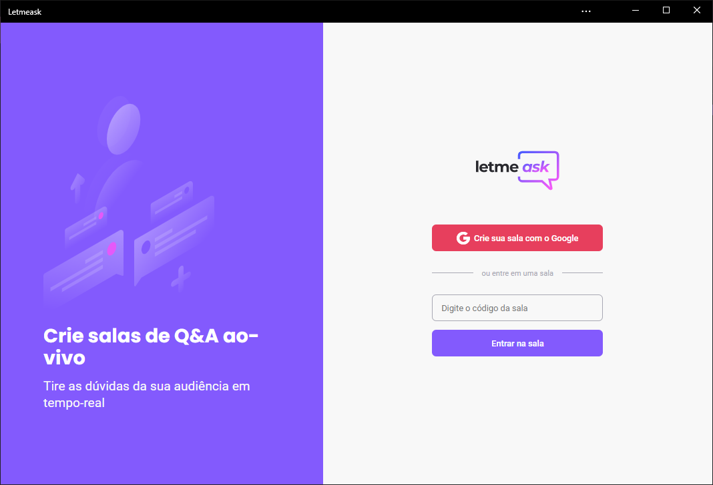
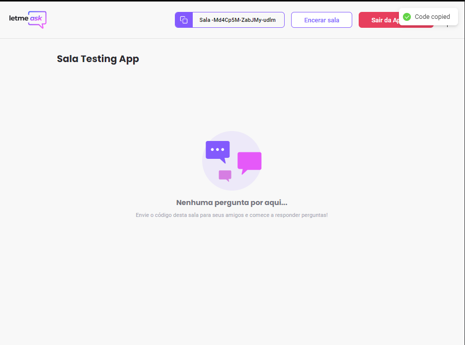
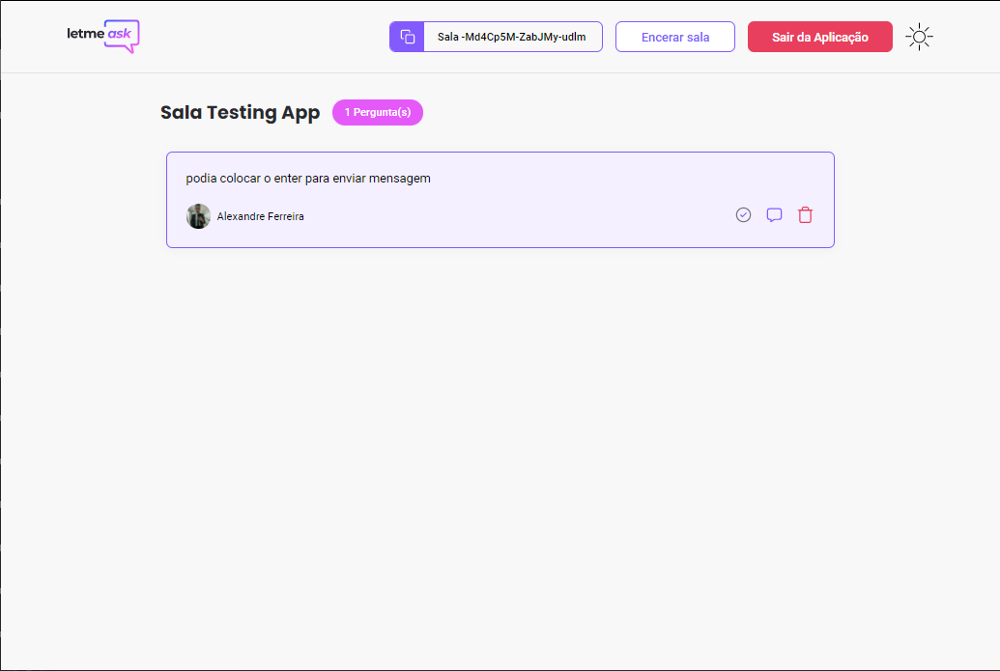
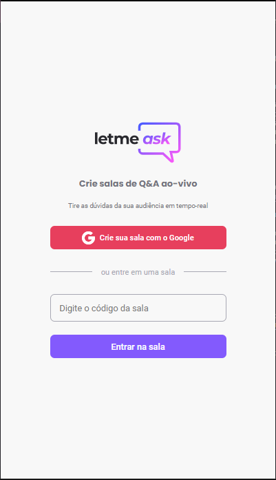
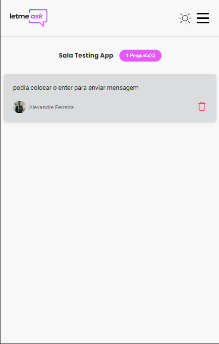

<h1 align="center">
  
</h1>

  

# Application developed at NLW 06

## ✨ Technologies

To develop this project the following technologies were used.:

- [React](https://reactjs.org)
- [TypeScript](https://www.typescriptlang.org/)
- [Styled-Components](https://styled-components.com/)
- [React-Modal](http://reactcommunity.org/react-modal)
- [React-Router-Dom](https://reactrouter.com/web/guides/quick-start)
- [Firebase](https://firebase.google.com/?hl=pt)

## 💻 Project

Letmeask is a Q&A app, you log into a room and submit your questions

## 📚 About Project

- Some functionality that exists in the App;
  - Authentication'
  - You can create rooms;
  - You can connect the room that already exists via Code;
  - Fully Responsive;
  - Dark theme

## 🔖 Layout

You can view the project layout through [this link](https://www.figma.com/file/u0BQK8rCf2KgzcukdRRCWh/Letmeask/duplicate).

## 🚀 How to run

- Clone the repository
- Install dependencies with `yarn`
- Start the server with `yarn start`

## 📷 Prints

---

  

  

  

  

  

Made with a lot of love 💙

